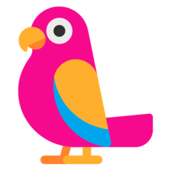
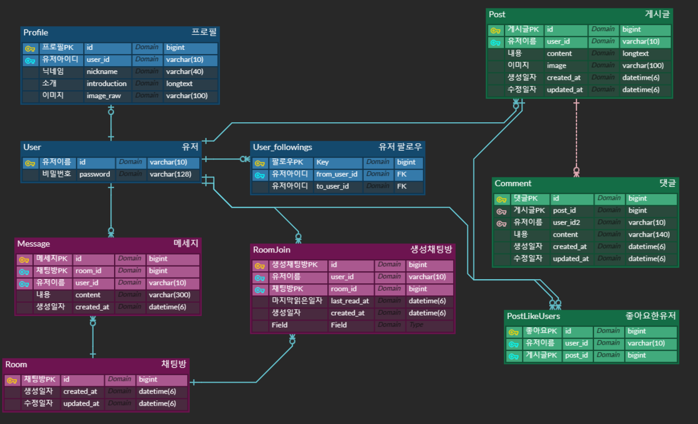
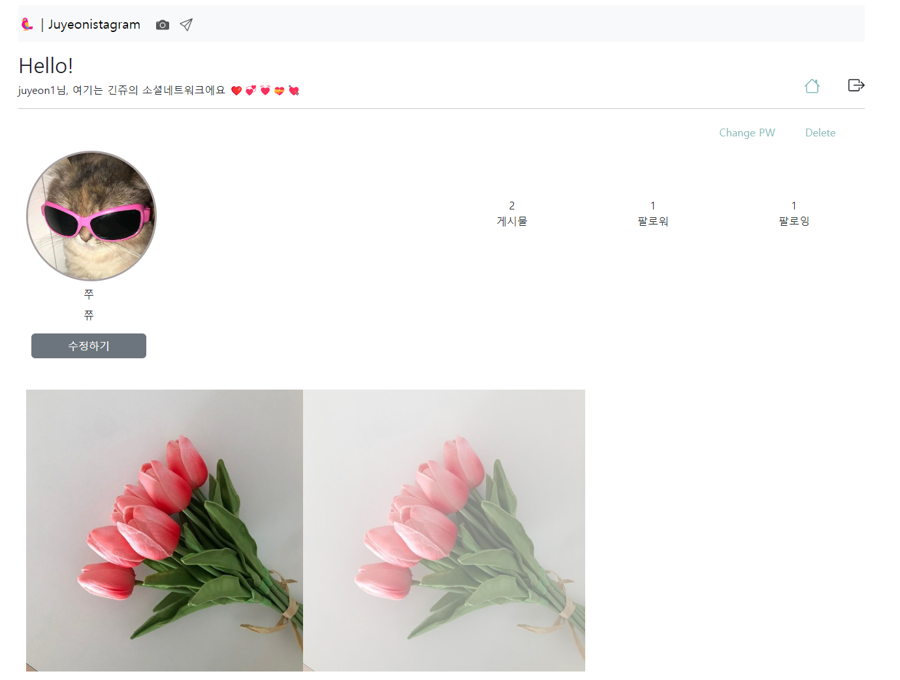
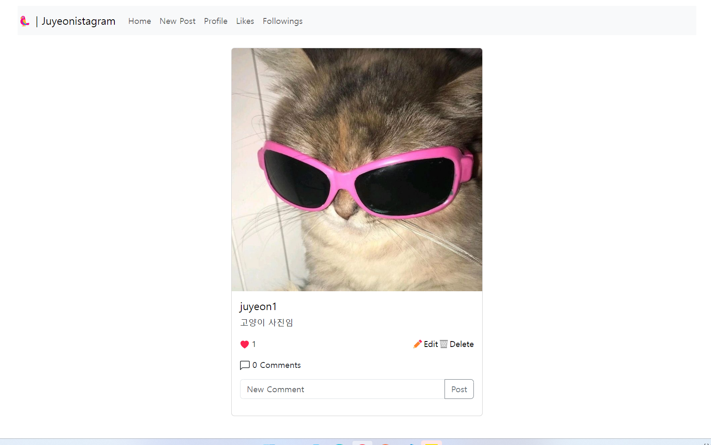
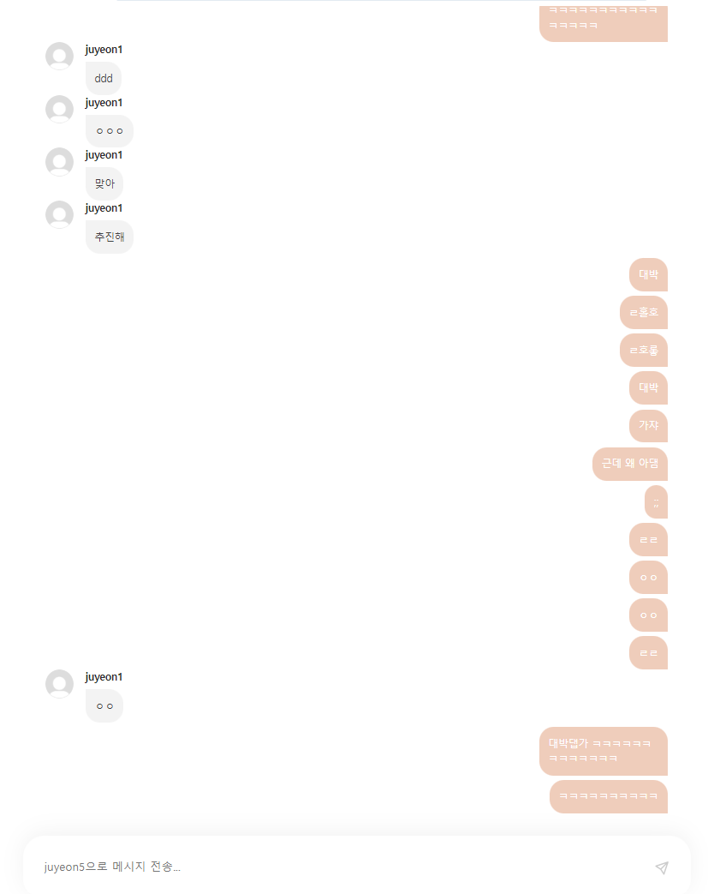

  
  
  
    
  Instagram, 일상을 담다 
  인스타그램을 벤치마킹하여 구현한 사진 공유 기반 커뮤니티 플랫폼 토이 프로젝트입니다. 

     

<h3>. 프로젝트 목표</h3>    

- 단순히 인스타그램의 핵심 기능을 구현하는 것이 아닌, 대용량 트래픽 상황을 고려하여 서버 성능 개선을 주 목표로 합니다.
- 클린코드 작성을 위해 지속적으로 코드 리팩토링을 진행합니다.
- DB 설계 및 쿼리 요청 최적화, 서버 확장성을 고려한 코드 작성을 고민합니다. 
- 백엔드 로직에 집중하기 위해서 프로토 타입으로 화면을 구성하는 등 프론트개발은 최소화하여 진행합니다. 

<h3>. 프로젝트 핵심 기능</h3>   

- 추천 게시물 피드에 표시 (협업 필터링)
- 실시간 채팅 기능 (DM) + 게시물 전송 기능
- 통합 검색 (게시물, 사용자, 해시태그, 장소)

<h3>. 프로젝트 전체 구성도</h3>   

  

   

<h3>. 구현중 이슈&해결과정</h3>   

- Restful 한 url 설계
- 동기/비동기 & Django 에서 웹소켓 연결시 비동기 처리 -> AsyncWebsocketConsumer 로 [django channels 공식 문서](https://channels.readthedocs.io/en/stable/topics/databases.html)
- ASGI & WSGI (django에서 비동기 동작을 할 수 있도록 실행하는 방법 - daphne/uvicorn/gunicorn-asgi 처리가 필요)
- Chat DB 설계 (개념적 모델링 -> 논리적 모델링) -> 식별관계, 비식별관계
- docker compose 문법
- 검색 로그: 브라우저 쿠키/세션/로컬스토리지에 저장(*세가지 차이점 공부) -> 나중에 db에 저장하도록 변경(게시물추천/검색어추천에 반영 가능성) 
- 장고 쿼리 요청 최적화 !!!!!  [참고](https://gaussian37.github.io/python-django-django-query-set/)

<h3>. ERD</h3>   

  

      

[ERD CLOUD URL](https://www.erdcloud.com/d/dYATsBLJTjadJYtjW)

<h3>. 화면 프로토 타입</h3>   

- 채팅 프론트 화면은 [lavlue](https://github.com/devpla/lavlue) 님 코드 참고했습니다. :)

   
  
  
<!--    -->

  

참고 문헌
https://dingrr.com/blog/post/django-redis-celery-%EC%A1%B0%ED%95%A9%EC%9C%BC%EB%A1%9C-%EB%B9%84%EB%8F%99%EA%B8%B0-%EC%9E%91%EC%97%85
