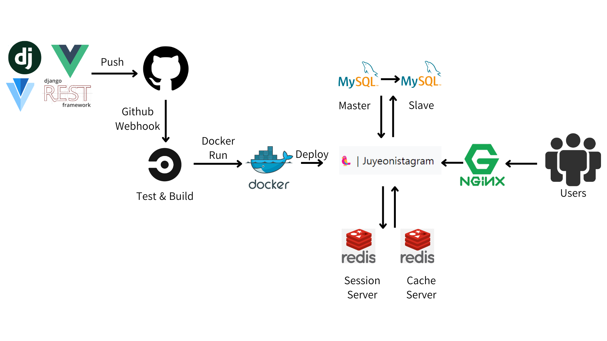

# insta_pjt

  
  
    
  Instagram, 일상을 담다 
  인스타그램을 벤치마킹하여 구현한 사진 공유 기반 커뮤니티 플랫폼 토이 프로젝트입니다. 

     

### 🦜. 프로젝트 목표   
- 인스타그램의 핵심 기능을 구현하는 것이 목표입니다. 
- 클린코드 작성을 위해 지속적으로 코드 리팩토링을 진행합니다.
- 대용량 트래픽 상황을 고려하여 서버 성능 개선, 서버 확장성을 주 목표로 합니다. 
- 백엔드 로직에 집중하기 위해서 프로토 타입으로 화면을 구성하는 등 프론트개발은 최소화하여 진행합니다. 

### 🦜. 프로젝트 핵심 기능
- 추천 게시물 피드에 표시 (협업 필터링)
- 실시간 채팅 기능 (DM) + 게시물 전송 기능
- 통합 검색 (게시물, 사용자, 해시태그, 장소)

### 🦜. 프로젝트 전체 구성도

  

   
 
### 🦜. 구현중 이슈&해결과정
- 블로그에 작성 후 link 걸어둘 예정

 
### 🦜. ERD

### 🦜. 화면 프로토 타입

참고 문헌
https://dingrr.com/blog/post/django-redis-celery-%EC%A1%B0%ED%95%A9%EC%9C%BC%EB%A1%9C-%EB%B9%84%EB%8F%99%EA%B8%B0-%EC%9E%91%EC%97%85
